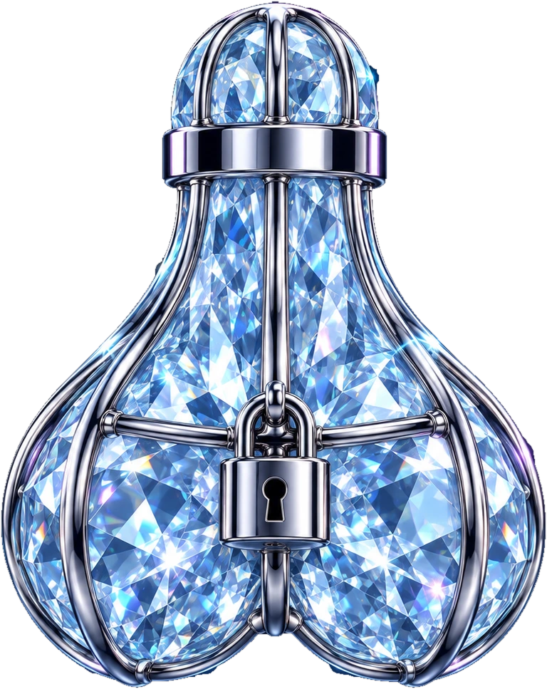

<p align="center">
  
</p>

<h1 align="center">Caged Diamond Balls</h1>
<p align="center"><strong>Diamond balls. On lock.</strong><br/>
Lock your pump.fun coins. Keep the holder rewards.</p>

<p align="center">
  <a href="https://x.com/cagedballs">X / @cagedballs</a> ·
  <a href="https://solscan.io/account/65cX8gGch8x4vQvU4gnpPcepwKadDSAtJ4ZgZg3hp61t">Program on Solscan</a>
</p>

---

## The problem

Pump.fun **Holder Rewards** coins send the creator fee of every trade to the people holding the coin.
Pump.fun pays those distributions itself, several times an hour, straight to each holder's wallet.

Lock your tokens in an ordinary locker and you stop being a holder. The vault contract holds the
tokens, so the vault gets the rewards, and they are gone.

## What Caged does

Every lock on Caged gets **its own holder address** that owns the vault token account. Pump.fun pays
that address like any other holder. The lock owner sweeps the rewards to their wallet whenever they
like, while the tokens stay locked until the unlock time they chose.

* **Your unlock date.** Pick a date and time. Extend any time. Never shorten.
* **Claim while locked.** SOL rewards (and token-quoted rewards such as XMR or stable-quoted coins)
  accumulate on the lock and are claimable at any moment.
* **Public proof.** Every lock has a shareable page anyone can verify on-chain. Every token has a page
  showing how much of its supply is locked and by whom.
* Works with classic SPL and Token-2022 mints.

## stonk.fun coins

stonk.fun coins (Token-2022 with a permanent 1–3% transfer tax that funds their rewards, paid in the
paired asset such as xStocks, pre-IPO tokens, ZEC or HYPE) can be locked too. Their distributor also pays
only ordinary wallet addresses, so use Caged custody mode to keep receiving. The transfer tax is charged
by the token on every transfer, including the lock deposit and the withdrawal.

## Two custody modes, one honest trade-off

Pump.fun's distributor only pays token accounts owned by an **ordinary on-curve address**. Program-derived
addresses are excluded (that is how pools and vaults are kept out), so a fully trustless vault can never be
paid. Caged therefore offers both:

| | Caged custody (default) | Trustless |
| --- | --- | --- |
| Holder address | a real keypair held by Caged's signing service | a program-derived address |
| Pump.fun holder rewards | paid to the lock | **not paid** |
| Who enforces owner, amount, unlock date, fees | the on-chain program | the on-chain program |
| Can Caged move locked tokens early | technically yes, with the holder key | no, nobody can |

In custody mode the program still checks every instruction, and the signing service only co-signs
transactions made of this program's instructions, but you are trusting Caged with the key. Trustless
locks can be migrated into custody by their owner at any time (same owner, amount and unlock date).

## Fees

| | |
| --- | --- |
| Lock creation | 0.1 SOL |
| Reward claims | 2% of the claimed amount |
| Top up, extend, withdraw, close | free |

Plus normal Solana network fees and refundable account rent, which comes back when a lock is closed.
Fees are capped in the program itself (max 1 SOL and 10%).

## The $CAGED reward match

$CAGED holders who lock for **7 days or more** are enrolled in a boost pool, first come, first served,
up to **25% of supply**. Enrolled locks receive a **1:1 match** on their net SOL holder rewards, paid
from a pool funded by the team's own locked allocation. If the pool runs dry, base rewards continue
unaffected.

## Public API

Free, no key, CORS enabled, cached ~20 seconds. Built for terminals and bots.

```
GET /api/locks/<mint>   totals, % of supply, boost pool, every lock for one token
GET /api/stats          protocol-wide counters
```

## On-chain

| | |
| --- | --- |
| Program | `65cX8gGch8x4vQvU4gnpPcepwKadDSAtJ4ZgZg3hp61t` |
| Framework | Anchor |
| Source | [`programs/holder_locker`](programs/holder_locker/src/lib.rs) |

The program is small and open source. Read it before locking large amounts. It has not been
independently audited.

Pump.fun decides who counts as a holder and how much each receives; Caged makes each lock
indistinguishable from a normal holder wallet, but pump.fun's rules can change at any time.

## Repository

```
programs/   Anchor program
web/        Next.js app (site + API)
tests/      program test suite
```

Developer notes: [docs/DEVELOPMENT.md](docs/DEVELOPMENT.md). Showing Caged locks in your terminal or screener: [docs/INTEGRATION.md](docs/INTEGRATION.md).
